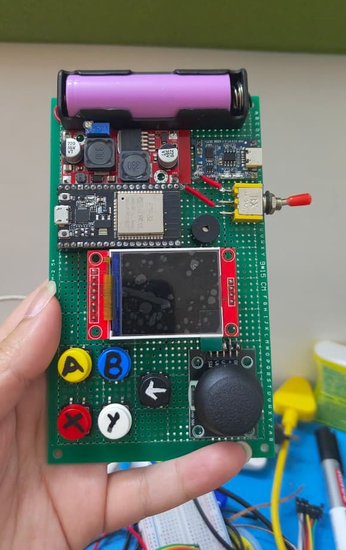

# Meantendo

<p align="center">
  
</p>

<p align="center">
  <strong>A DIY ESP32 Handheld Gaming Console</strong><br>
  <em>13 games. Infinite demos. Built from scratch.</em>
</p>

<p align="center">
  <a href="https://www.arduino.cc/"></a>
  <a href="https://platformio.org/"></a>
  <a href="https://www.espressif.com/en/products/socs/esp32"></a>
  <a href="LICENSE"></a>
</p>

---

## Demo
[](https://www.youtube.com/shorts/cb1YR2BpdeY?feature=share)
---

## Features

- **13 playable games** including Snake, Pong, Tetris, Flappy Bird, Asteroids, Breakout, and Conway's Game of Life
- **Visual demos** — Matrix Rain, Kaleidoscope, Maze Solver, Particles, Fractals, Slime Simulator
- **Hardware controls** — Analog joystick + 6-button layout (A, B, X, Y, Select, Back)
- **Buzzer audio feedback** — click, confirm, and error sounds
- **Animated menu** — auto-scrolling, category headers, animated cursor, scanline transitions
- **Flicker-free splash screen** — fade-in/out Debyte logo on boot
- **20MHz SPI** — buttery smooth gameplay on the ST7735 display

---

## Hardware

| Component | Model |
|---|---|
| Microcontroller | ESP32 Dev Board (38-pin) |
| Display | 1.8" ST7735 TFT (160×128) |
| Input | Analog joystick + 5 tactile buttons |
| Audio | Passive buzzer |
| Bus | SPI @ 20MHz |

**Total build cost:** ~₹800–1200

See the [Bill of Materials](docs/BOM.md) for full parts list and links.

---

## Getting Started

### Prerequisites

- [PlatformIO Core](https://docs.platformio.org/page/core.html) or [PlatformIO IDE](https://platformio.org/install/ide?install=vscode) (VS Code extension)
- ESP32 toolchain (installed automatically by PlatformIO)
- A USB cable capable of data sync

### Installation

```bash
# Clone the repository
git clone https://github.com/Debyte404/Meantendo.git
cd Meantendo

# Install dependencies and build
pio run

# Upload to your ESP32 (ensure COM port is correct in platformio.ini)
pio run --target upload

# Monitor serial output
pio device monitor
```

Or open the project in **VS Code** with the PlatformIO extension installed and click **Upload**.

> **Note:** Unplug the TFT display's CS wire (GPIO 5) before uploading, then reconnect it after flashing. The display can interfere with SPI during programming.

---

## Project Structure

```
Meantendo/
├── src/
│   ├── main.cpp          # Entry: init → splash → menu loop
│   ├── core/             # Shared engine
│   │   ├── Game.hpp      # GameDef registry + registration
│   │   ├── Display.hpp   # TFT SPI init, pin mapping
│   │   ├── Input.hpp     # Joystick + button reads
│   │   ├── Buzzer.hpp    # Audio feedback
│   │   ├── Menu.hpp      # UI: categories, cursor, scrollbar
│   │   └── Splash.hpp    # Fade-in/out logo
│   └── games/            # Game implementations
│       ├── Snake.cpp
│       ├── Pong.cpp
│       ├── Tetris.cpp
│       ├── Breakout.cpp
│       ├── Asteroids.cpp
│       ├── FlappyBird.cpp
│       ├── GameOfLife.cpp
│       ├── Kaleidoscope.cpp
│       ├── MatrixRain.cpp
│       ├── MazeSolver.cpp
│       ├── Particles.cpp
│       ├── Fractals.cpp
│       └── SlimeSim.cpp
├── assets/           # Product photos, demo video
│   ├── product.jpeg
│   ├── wiring.jpeg
│   └── earlydemo.mp4
├── docs/
│   ├── BOM.md            # Bill of materials
│   └── wiring_guide.md   # Pinout and wiring diagram
├── include/              # Header files
├── test/                 # Unit tests
├── platformio.ini        # Build configuration
└── README.md
```

---

## Controls

| Button | Action |
|---|---|
| **Joystick** | Navigate menu / move player |
| **A** | Select / confirm |
| **B** | Back / cancel |
| **X / Y** | Reserved |
| **Select** | Alternate confirm |
| **Back** | Exit game to menu |

---

## Pinout

| Component | ESP32 GPIO |
|---|---|
| TFT CS | GPIO 5 |
| TFT DC | GPIO 16 |
| TFT RST | GPIO 17 |
| TFT SCLK | GPIO 18 |
| TFT MOSI | GPIO 23 |
| Joystick X | GPIO 34 (ADC) |
| Joystick Y | GPIO 35 (ADC) |
| Joystick SW | GPIO 19 |
| Button A | GPIO 32 |
| Button B | GPIO 33 |
| Button X | GPIO 26 |
| Button Y | GPIO 27 |
| Button Back | GPIO 25 |
| Buzzer | GPIO 15 |

See [wiring_guide.md](docs/wiring_guide.md) for the full pinout table and wiring photos.

---

## Credits

Built with caffeine by **Debyte**

Libraries used:
- [Adafruit GFX](https://github.com/adafruit/Adafruit-GFX-Library)
- [Adafruit ST7735](https://github.com/adafruit/Adafruit-ST7735-Library)
- [Arduino](https://www.arduino.cc/)
- [ESP32](https://www.espressif.com/en/products/socs/esp32)

---

## License

MIT License — see [LICENSE](LICENSE)
