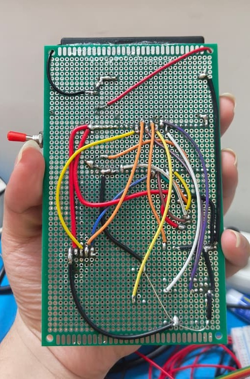

# Meantendo — Wiring Guide

<p align="center">
  <!--  -->
</p>

<p align="center">
  <em>Complete wiring diagram for the Meantendo ESP32 handheld console.</em>
</p>

---

## Pinout Summary

All connections are between the **NodeMCU ESP-32S (38-pin)** and external components.

### Display — ST7735 1.8" TFT (SPI)

| TFT Pin | ESP32 GPIO | Notes |
|---|---|---|
| VCC | 3.3V | Power |
| GND | GND | Ground |
| LED | 3.3V | Backlight |
| CS | **GPIO 5** | SPI Chip Select |
| DC | **GPIO 16** | Data/Command |
| RESET | **GPIO 17** | Display reset |
| SCK | **GPIO 18** | SPI Clock |
| SDA | **GPIO 23** | SPI MOSI |

### Joystick — Analog XY Module

| Joystick Pin | ESP32 GPIO | Notes |
|---|---|---|
| VCC | 3.3V | Power |
| GND | GND | Ground |
| VRx | **GPIO 34** | X-axis (ADC) |
| VRy | **GPIO 35** | Y-axis (ADC) |
| SW | **GPIO 19** | Push button (active LOW) |

### Action Buttons — 12×12mm Tactile

| Button | ESP32 GPIO | Notes |
|---|---|---|
| A | **GPIO 32** | Main confirm |
| B | **GPIO 33** | Back / cancel |
| X | **GPIO 26** | Reserved |
| Y | **GPIO 27** | Reserved |
| Back | **GPIO 25** | Exit to menu |

### Buzzer — Passive Piezo

| Buzzer Pin | ESP32 GPIO | Notes |
|---|---|---|
| Signal (+) | **GPIO 15** | PWM tone output |
| GND (−) | GND | Ground |

---

## Quick Reference

```
ESP32          ST7735 TFT
────────       ──────────
3.3V    ────  VCC
GND     ────  GND
3.3V    ────  LED
GPIO 5  ────  CS
GPIO 16 ────  DC
GPIO 17 ────  RESET
GPIO 18 ────  SCK
GPIO 23 ────  SDA

ESP32          Joystick
────────       ────────
3.3V    ────  VCC
GND     ────  GND
GPIO 34 ────  VRx
GPIO 35 ────  VRy
GPIO 19 ────  SW

ESP32          Buttons
────────       ───────
GPIO 32 ────  A
GPIO 33 ────  B
GPIO 26 ────  X
GPIO 27 ────  Y
GPIO 25 ────  Back

ESP32          Buzzer
────────       ──────
GPIO 15 ────  Signal
GND      ────  GND
```

---

## Hardware Notes

### Joystick Calibration

The software uses a center value of `2048` (12-bit ADC). Deadzone is ±400. If your joystick axes are inverted or swapped, edit `readJoystickContinuous()` in `src/core/Input.hpp`.

### Button Pull-ups

All buttons use the ESP32's internal pull-up resistors — no external resistors needed. Each button is wired between the GPIO pin and GND. A press reads as `LOW`.

### Display Voltage

Most ST7735 modules have an onboard 3.3V regulator. Safe to power from the ESP32's `3V3` pin. **Do not** connect `5V` unless your module explicitly supports it.

### Upload Note

> **Important:** Unplug the TFT's CS wire (GPIO 5) before uploading firmware via USB, then reconnect it. The display can interfere with SPI programming.

### Buzzer

The code uses `ledcWriteTone()` for pitch control — a **passive buzzer** produces tones; an active buzzer will still work but only at one pitch.

---

## Wiring Photo

<p align="center">
  
</p>
